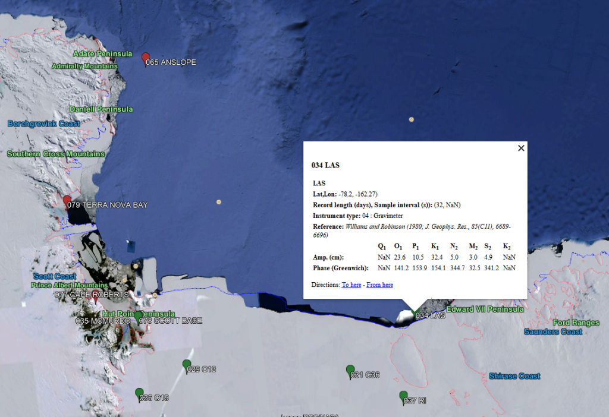

# ATG_Database_Tools
<h3>Antarctic Tide Gauge Database Tools</h3>

The <b>Antarctic Tide Gauge (ATG) database </b>is a database of ocean tide surface height harmonic coefficients (amplitude and phase) from a variety of measurement systems. These coefficients are primarily intended for users interested in validation of tide models for the Antarctic seas including the areas covered by the large floating ice shelves; see, e.g. <a href="https://agupubs.onlinelibrary.wiley.com/doi/full/10.1029/2005GL023901">King and Padman (2005)</a>.

Data contributing to the ATG database vary widely in quality, from short records of unknown accuracy, to very precise, long-term records. This database provides sufficient information for a user to judge whether a tidal analysis at a particular site should be used for their application.

Data have been collected using a wide variety of measurement techniques. These include:
<ul>
  <li>Coastal Tide Gauge (CTG: e.g., floats in stilling wells);</li>
    <li>Bottom Pressure Recorder (BPR);</li>
    <li>Global Positioning System (GPS) on ice shelves;</li>
    <li>Gravimeter on ice shelves; and</li>
    <li>Wire length loggers on ice shelves.</li>
  </ul>

The highest-quality data come from CTG, BPR and modern GPS records. The major tidal constituents are best separated if more than 1/2-year of data are available. Many Antarctic records are less than 29 days long, so that they are difficult to analyze for a sufficient number of major tides to develop reliable predictive models for that site. Nevertheless, because so few tide records exist in the region, these shorter records (and, of course, the intermediate-length records between 29 days and 1/2 year long) may be valuable to some users.

Information on each site can be viewed by downloading the database in any of the following formats:
<ul>
  <li> <b>KML package</b> for Google Earth</li>
  <li> <b>ASCII text file </b></li>
  <li> <b>Matlab *.mat file </li>
</ul>

Contact Laurie Padman (ESR; padman@esr.org) for more information, or to submit new datasets to the database.

Further information can be found at 
https://www.esr.org/data-products/antarctic_tg_database/
